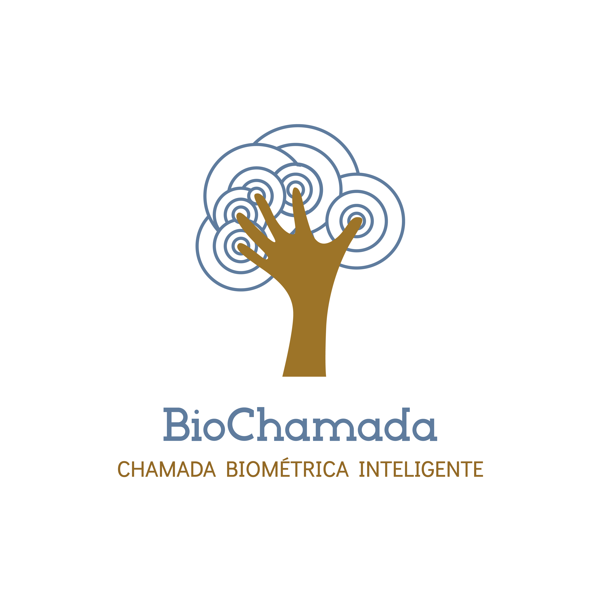

# BioChamada

## Descrição

BioChamada é uma aplicação *web* desenvolvida em [*PHP*](https://www.php.net/docs.php) para auxiliar no controle de frequência de estudantes nas aulas.
Foi idealizada para ser integrada com um dispositivo biométrico com conexão *wireless*, para *realizar a chamada* em sala de aula coletando a digital dos estudantes.

### Funcionalidades
BioChamada possui funcionalidades para auxiliar professores ou instituições no controle de frequência em sala de aula, dentre as quais possui:
- Cadastro dos alunos matriculados nas turmas
- Listagem de alunos do professor
- Geração de gráficos referente à presença nas aulas